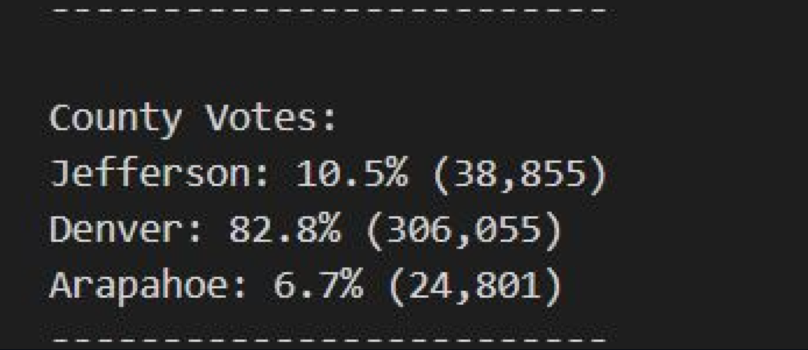
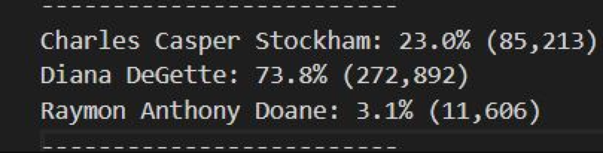
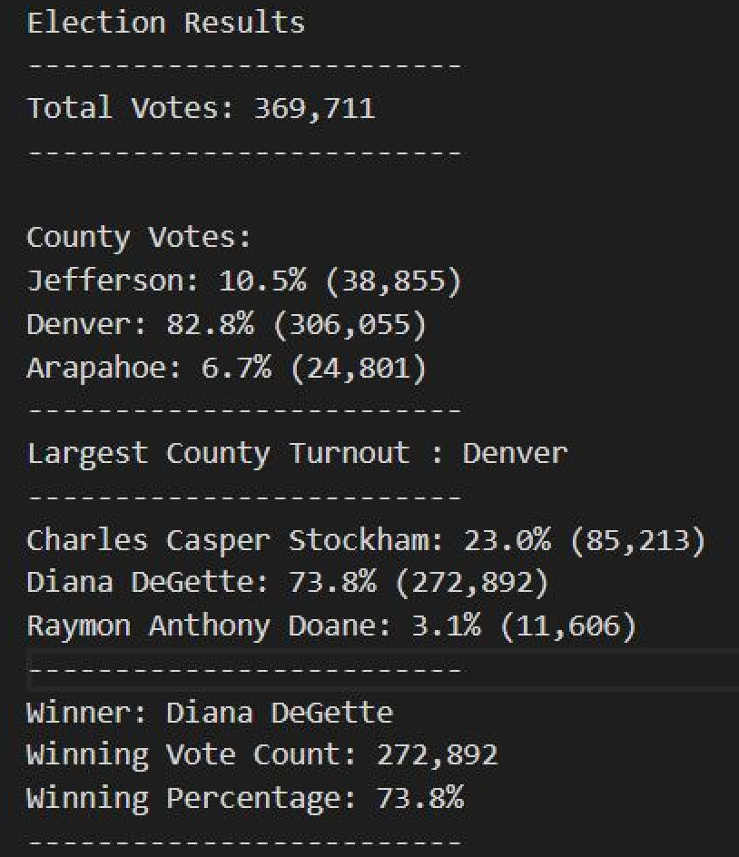

# election-analysis
## Overview of Election Audit
The project's goal was to help Tom, a Colorado Board of Elections employee, audit tabulated results for a US congressional precinct in Colorado. Furtermore, the objective was to automate the process by writing a python script to successfully audit this election using the data source of a CSV file containing the tabulated totals for the elections from various voting methods. Lastly, we used the following metrics were calculated as part of the audit to determine the election winner:

1. Total number of votes cast for the election
2. Total number of votes for each candidate
3. Percentage of votes for each candidate
4. Winner of the election based on the popular vote
5. Voter turnout for each county
6. Percentage of votes for each county out of the total count
7. County with the highest turnout

Following the successful completion of the audit and presentation of the election results, a proposal is written on how the script can be successfully implemented in future elections.

# Election Audit Results

• 369,711 votes were cast in this congressional election
• The number of votes and the percentage of total votes for each county in the precinct (Jefferson: 10.5% (38,855) Denver: 82.8% (306,055) Arapahoe: 6.7% (24,801))

• The county with the largest number of votes was Denver
• The number of votes and the percentage of the total votes each candidate received (Charles Casper Stockham: 23.0% (85,213) Diana DeGette: 73.8% (272,892) Raymon Anthony Doane: 3.1% (11,606))

• Diana DeGette won the election with a vote count of 272,892 which made up 73.8% of the total votes.

## Election-Audit Summary
The Python script used to audit this congressional election result helps us automate electoral calculations to identify the winner of an election quickly. In addition, it will assist the election board in publishing these results as soon as the vote counts are completed and data is available. Not only will this increase the speed with which election audits are completed, but it will also reduce the possibility of human error when other tools, such as Excel, are used to perform such calculations. 

Furthermore, you can also use it in future elections planned by the Colorado Board of Elections with minor changes if the popular vote determines the winner. Using a few modifications, such as the ones listed below, you can use this same script to determine winners of future elections.

1. When a variable is added to the script, change the line to the appropriate path to load and save the path as you will store future election results in a different CSV file.

2. If you wanted to analyze an election on a countrywide level, you could use the same tools but use states instead of counties.
